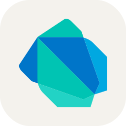
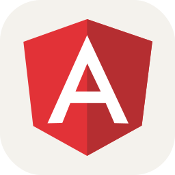
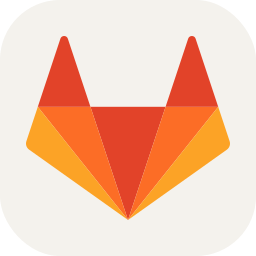

  

<h1 align="center"> 👋 Olá, eu sou Paulo Vitor </h1>
<h3 align="center">💻 Desenvolvedor Full-Stack (Front-End) | 📱 Desenvolvedor Mobile | 📊 Entusiasta em dados</h3>

 

## 🧑‍💻 Sobre mim

  Sou um estudante de Sistemas de Informação apaixonado por tecnologia, especialmente desenvolvimento e dados. Atualmente,
  estou focado em desenvolvimento web e mobile, mas também me interesso fortemente na área de dados.
    
  - 🚀 Atualmente, trabalhando na empresa <strong>SergipeTec</strong> alocado na <strong>SEFAZ/SE</strong> como desenvolvedor Front-End. 
  - 📚 Aprendendo sobre <strong>Angular</strong>, <strong>Typescript</strong> e <strong>Flutter</strong>. 
  - 💬 Me pergunte sobre <strong>C#</strong>, <strong>Python</strong> e <strong>JavaScript</strong>. 
  - 📫 Como me encontrar: paulovsnts.dev@gmail.com  
  - 🎷 Curiosidade: fora da programação, eu sou saxofonista e tenho bastante interesse nos mundos gamer e geek.

 

<h2>🚀 Tecnologias e Ferramentas</h2>

<h3>🧠 Linguagens</h3>

  
  
  
  
  
  

<h3>🧩 Frameworks</h3>

  
  
  
  
  

<h3>🗄️ Bancos de Dados</h3>

  
  
  
  

<h3>🛠️ Ferramentas e Serviços</h3>

  
  
  
  
  
  
  

 

## 📊 Minhas Estatísticas no GitHub

  

 

## 🌐 Conecte-se comigo

  
  
  
  

